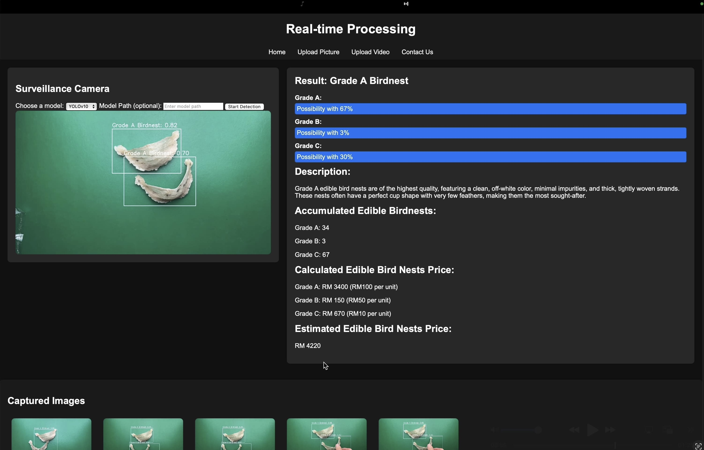

# 🐦 Edible Bird Nest Grading System
## 📝 Overview  
This project is a **web-based system** designed for **real-time grading of edible bird nests** using **deep learning models**. It leverages **YOLO** for object detection and **FastAPI** for seamless integration between the model and web application. 

## 🚀 Features  
- **Automated Grading** – Uses YOLO to classify bird nests based on quality and characteristics.  
- **FastAPI Integration** – Provides an efficient backend API for model inference.  
- **User-Friendly Web Interface** – Allows users to upload images/videos and receive grading results.  
- **Data Preprocessing & Augmentation** – Improves model accuracy with enhanced training data.  

## 📖 Documentation
Please refer to user_guide.pdf in the docs/ folder for setup instructions.

## 🖥️ User Interface

## 🎬 Demo Video
https://github.com/user-attachments/assets/62347ad8-76bf-4493-9183-f4ca211dae72
